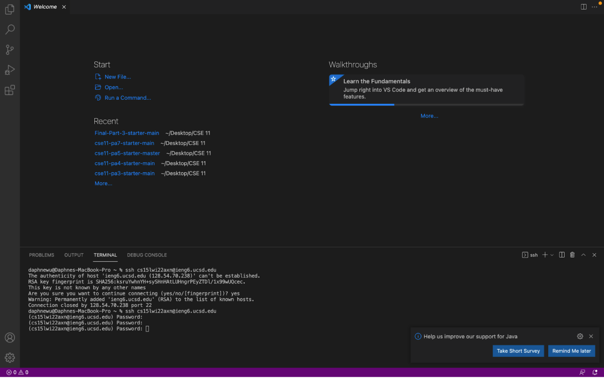

# Lab Report 1 Week 2
---
## *Tutorial for remote access*
## **Part 1**: Installing VScode

Go to the [Visual Studio Code website](https://code.visualstudio.com/) and read the instructions to install it onto your computer. *Make sure its the correct version!* 
<br />
Here is what it should look like after installations (may have different color, menu bar, etc. depending on systems/settings):
<br /> 


<!--  -->

## **Part 2**: Remotely Connecting
 If you are on a windows computer you must install [OpenSSH](https://docs.microsoft.com/en-us/windows-server/administration/openssh/openssh_install_firstuse) in order to remotely connect.
<br />
Next, look up your course-specific account for CSE15L here:
https://sdacs.ucsd.edu/~icc/index.php
<br /> For example, mine is: *cs15lwi22axn*
<br /> Now, open a terminal on VSCode and it should look like this:
 ```
 $ ssh cs15lwi22zz@ieng6.ucsd.edu
```
The **zz** are replaced by letters in course specific account (ex: mine are axn).
<br /> 

<br /> 
INSERT IMAGE
<br />
YAY! Now your terminal is connected to a computer in the CSE basement. **SO COOL.** The commands you run on your terminal will run on that computer! Your computer is called the client and the computer in the basement is called the server based on your connection.

## **Part 3**: Trying Some Commands
Let's start off by trying some simple commands. Use these in your terminal and test them out.
* **cd** (this command "changes directory" to a specified one)
* **ls** (this command lists the files/folders in the current directory)
* **pwd** (this command "prints working directory")
* **mkdir** (this command makes a new directory of a specified name)
* **cp** (this command is used to make a copy of a specified file)
<br />
 Here is an example of running some commands:
 <br />
INSERT IMAGE

## **Part 4**: Moving Files with **scp**
A key part of working remotely is being able to copy files between the computers back and forth. 

To copy files from your computer to a remote computer, use the command **scp**. We will always run this from the *client* meaning from your own computer, not logged into ieng6.

Here is an example of using this command:
(I copied the WhereAmI.java file to the ieng6 server)

INSERT IMAGE

## **Part 5**: Setting an SSH key
We're going set an SSH key to avoid having to enter our password everytimg we log in or run **scp**. 
(We are going to use a program called **ssh-keygen**, which creates a pair of files called *public key* and *private key*. We are going to copy the public key to a particular location on the serve and the private key to a partiuclar location on the client. Then, the **ssh** command uses the pair of files in place of your passowrd. 

To do so type the following in terminal on client (your computer):
```
$ ssh-keygen
```

This created two new files on your system...

The private key (in a file id_rsa) and the public key (in a file id_rsa.pub), stored in the .ssh directory on your computer.

> Sidenote: (If using Windows, follow the extra ssh-add steps here: https://docs.microsoft.com/en-us/windows-server/administration/openssh/openssh_keymanagement#user-key-generation)

INSERT IMAGE

Now we have to copy the public key to the **.ssh** directory of your user account on the server.
Do the following:
```
$ ssh cs15lwi22zz@ieng6.ucsd.edu
<Enter Password> //the path you saw in the command above
// now on server
$ mkdir .ssh
$ <logout>
//back on client
$ scp /Users/joe/.ssh/id_rsa.pub cs15lwi22@ieng6.ucsd.edu:~/.ssh/authorized_keys
```
Now, should be able to ssh or scp from this client to the server without entering your password.


INSERT IMAGE

## **Part 7:** Optimizing Remote Running
To optimize remote running, here are some tricks that will help!

* Writing a command in quotations at the end of an ssh command will directly run it on the remote server. For example
```
$ ssh cs15lwi22@ieng6.ucsd.edu "ls"
```
* This can also be done when running multiple commands in the same line (do this by using ";"):
```
$ ssh cs15lwi22@ieng6.ucsd.edu "WhereAmI.java OtherMain.java; javac OtherMain.java; java WhereAmI"
```


