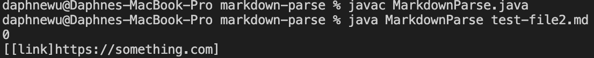
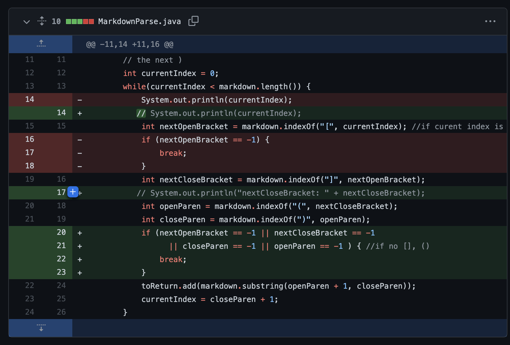
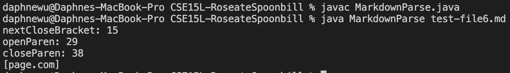
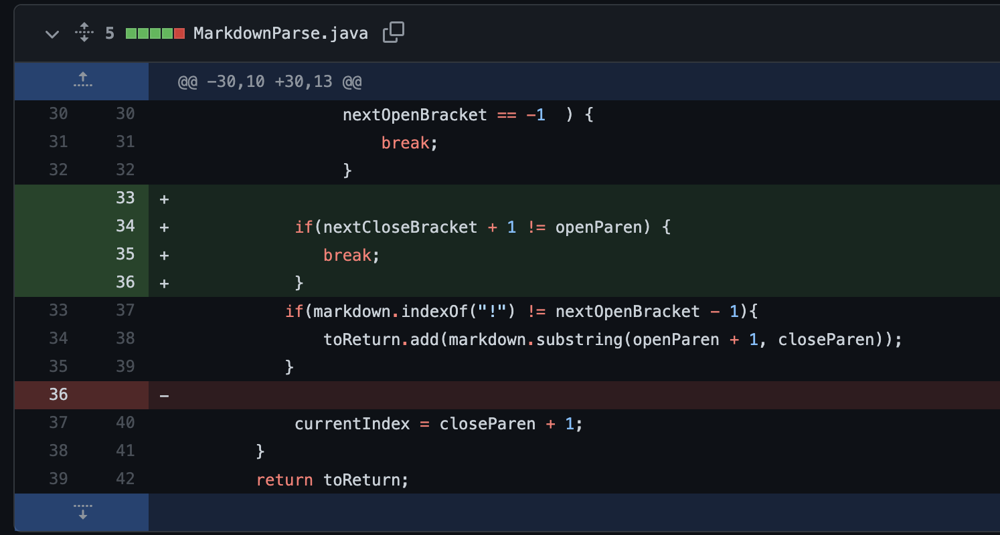
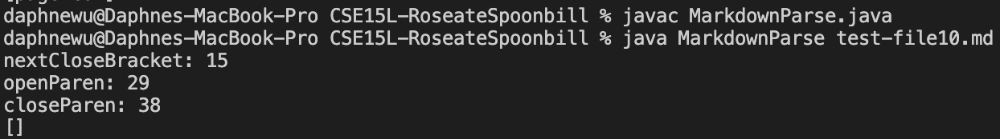
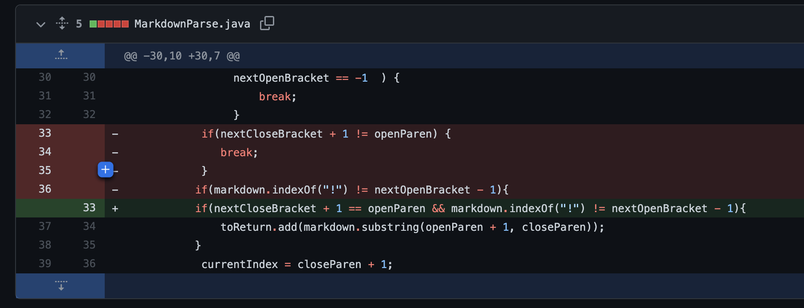

# Lab Report 2 Week 4
---
## *Fixing bugs*

## **Code Change 1**: From Lab 3
We noticed while testing, that when our parser took in the [test-file2.md](https://github.com/Daphne-wu/markdown-parse/blob/main/test-file2.md), the wrong thing was outputted by the parser. It was expected that the parser return an empty ArrayList <mark style="background-color: lightblue">[]</mark>. Instead, the parser printed <mark style="background-color: lightblue">[[link]https://something.com]</mark>. This had to be fixed in our code in the MarkdownParse.java file. 

Here is a link the test file for a failure-inducing input that prompted me to make that change: [test-file2.md](https://github.com/Daphne-wu/markdown-parse/blob/main/test-file2.md)

* Here is the symptom of that failure-inducing input:
Output of running the file at the command line for the version where it was failing:

[test-file2.md](https://github.com/Daphne-wu/markdown-parse/blob/main/test-file2.md) does not have a valid link, so no links should have been outputted. Yet, [link]https://something.com] was. 
* Here is a screenshot of a code change diff from Github in the MarkdownParse.java:

The fix was that we needed to check whether all parts of [] and () were in the "link" in order to ensure that it is valid. If those characters don't exist, -1 would be returned. This was done for all the characters instead of just an open bracket.

> The relationship between the bug, the symptom, and the failure-inducing input is the following:
* The bug was that the code did not check for whether there existed complete brackets and paranthesis (i.e. "[]" and "()"). A valid link requires a complete set of both.
* In the case of test-file2.md. there was a "link" that did not have a open parenthesis "(" meaning that the link was not valid. However, our code did not check for that. 
* The symptom was having[[link]https://something.com] outputted when we ran the file at the command line, rather than an empty arrayList.

## **Code Change 2**: From Lab 4 
We noticed while testing, that when our parser took in the [test-file6.md](https://github.com/Daphne-wu/CSE15L-RoseateSpoonbill/blob/main/test-file6.md), the wrong thing was outputted by the parser. It was expected that the parser return an empty ArrayList <mark style="background-color: lightblue">[]</mark>. Instead, the parser printed <mark style="background-color: lightblue">[page.com]</mark>. This had to be fixed in our code in the MarkdownParser.java file. 

Here is a link the test file for a failure-inducing input that prompted me to make that change: [test-file6.md](https://github.com/Daphne-wu/CSE15L-RoseateSpoonbill/blob/main/test-file6.md)

* Here is the symptom of that failure-inducing input:
Output of running the file at the command line for the version where it was failing:

[test-file6.md](https://github.com/Daphne-wu/CSE15L-RoseateSpoonbill/blob/main/test-file6.md) does not have a valid link, so no links should have been outputted. Yet, page.com was. 
* Here is a screenshot of a code change diff from Github in the MarkdownParser.java:

The fix was that we needed to check whether the next char after the "]" was "(". If it is not, then it is not a valid link. Thus, we break and don't add anything to the toReturn arrayList.

> The relationship between the bug, the symptom, and the failure-inducing input is the following:
* The bug was that the code did not check for whether there was anything between the closed bracket and the open parenthesis. A valid link should not have anything between the close brackets [] and the parenthesis holding the link address ().
* In the case of test-file6.md. There were returns and characters between the [] and (). This made test-file6.md a failure-inducing input. 
* The symptom was having a page.com outputted when we ran the file at the command line, rather than an empty arrayList.

## **Code Change 3**: From Lab 4 
We noticed while testing, that when our parser took in the [test-file10.md](https://github.com/Daphne-wu/CSE15L-RoseateSpoonbill/blob/main/test-file10.md), the wrong thing was outputted by the parser. It was expected that the parser output <mark style="background-color: lightblue">[test.com]</mark>. Instead an empty ArrayList <mark style="background-color: lightblue">[]</mark> was outputted. This had to be fixed in our code in the MarkdownParser.java file. 

> Here is a link the test file for a failure-inducing input that prompted me to make that change: [test-file10.md](https://github.com/Daphne-wu/CSE15L-RoseateSpoonbill/blob/main/test-file10.md)

* Here is the symptom of that failure-inducing input:
Output of running the file at the command line for the version where it was failing:

[test-file10.md](https://github.com/Daphne-wu/CSE15L-RoseateSpoonbill/blob/main/test-file10.md) has a valid link so it should have been outputted. Yet, only an empty arrayList was outputted.
 * Here is a screenshot of a code change diff from Github in the MarkdownParser.java to fix this bug:

The fix was instead of breaking the code when the next char after "]" was not "(", we would instead check whether the next char after "]" was "(" (and other conditions). If that is the case, then we would add the link to the toReturn arrayList. 

> The relationship between the bug, the symptom, and the failure-inducing input is the following:
* The bug was that the code would "break" if the there was something between the [] and (). While this works for the specific case of [test-file6.md](https://github.com/Daphne-wu/CSE15L-RoseateSpoonbill/blob/main/test-file6.md), it does not work if there are additional valid links that are later on in the file. 
* In the case of test-file10.md. There was an invalid link that would break the code, but later on in the file there was a valid link that the parser would not get to check. This made test-file10.md a failure-inducing input. 
* The symptom was having an empty ArrayList being outputted when we ran the file at the command line, rather than [test.com].
