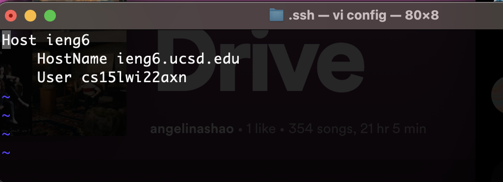
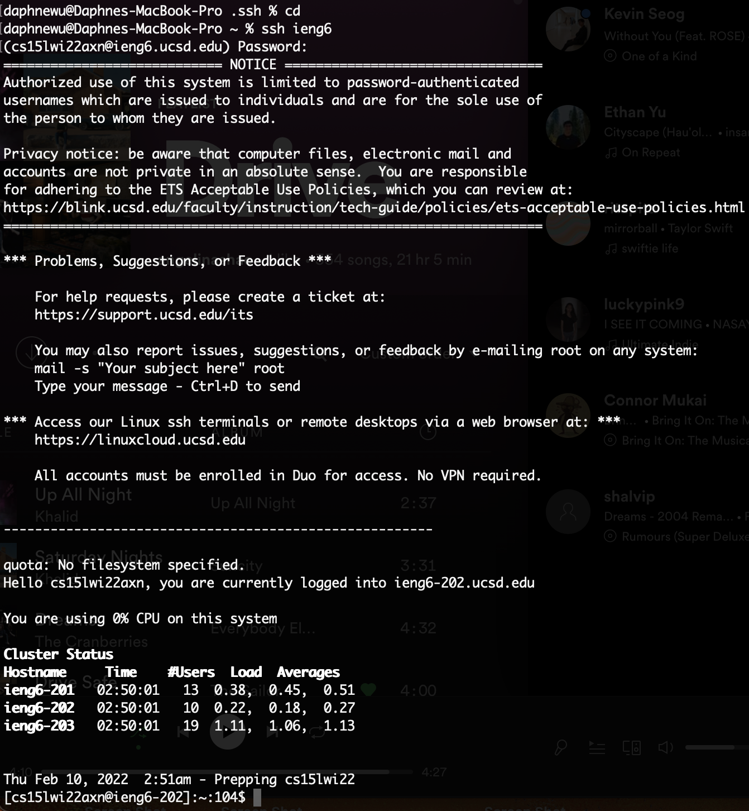
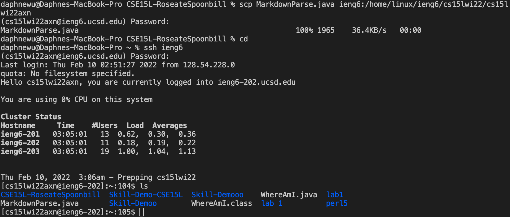
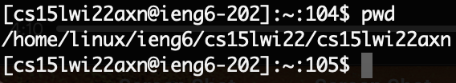

# Lab Report 3 Week 6
---
## *Streamline ssh Configuration*
Having to always type out your account name when you log into ieng6 can be a hassle. 

This is what we usually use to log in:

```
$ ssh cs15lwi22zzz@ieng6.ucsd.edu
```
To save some time and typing, we can create a configuration file.
In order to do this, we need to put an entry in our ~/.ssh/config that tells SSH the username to use when logging into specific servers. You can even give servers nicknames. 

Here is how I went into my .ssh/config file:

Here is how I edited it (I typed "vi config into my terminal to use vim to edit the config file). Type "i" to insert, and then esc + : + wq, to safe and exit. 

> The hostName is the server that we log into with my username "cs15lwi22axn". I chose to use the alias "ieng6".

Now, lets try logging into my account with the alias:

I just entered:
```
$ ssh ieng6
```
and entered my password. 

Here is an example of using an scp command to copy a file to my account using the alias.

In the server, I printed my working directory using "pwd" to see where to copy the file.

