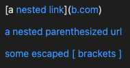
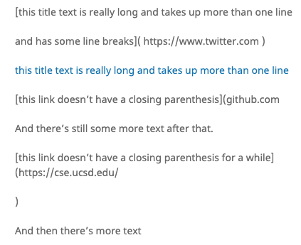
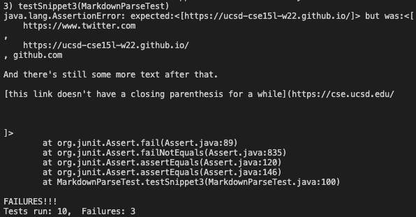

# Lab Report 4 Week 9
---
## *Testing Markdown Parse*
> Here is a link to my implementation: [link](
> Here is a link to the implementation I reviewed: [link](https://github.com/Shree-G/markdown-parse)


## Snippit 1
*My implementation*


#*Reviewed implementation*
From using the VScode preview, I found that there are only two valid links in snipit 1.


* Expected output should be: [`google.com]

To test snippit 1, I added the following test to MarkdownParseTest of reviewed code:
```
   @Test
    public void testSnippet1() throws IOException{
        Path fileName = Path.of("snippit-1.md");
	    String contents = Files.readString(fileName);
        ArrayList<String> result = MarkdownParse.getLinks(contents);
        List<String> expected = List.of("url.com", "`google.com");
        assertEquals(expected, result);
    }
```

Then, I used the command "make test" to run the test on the code. The test did not pass. Here is the specific part of the JUnit output that shows the test failure:


Question 1: 
I think there is a small code change that will make the program work for snippit 1 and related cases that use inline code with backticks. By checking the indicies of the back ticks and seeing whether the backticks close or not/ Also, checking whether the "link" in question is found inside the backticks (the linke wouldn't be valid). The reviewed code already has checks for three backticks, and can add an additional test for indivisual backticks.


## Snippit 2
*My implementation*


#*Reviewed implementation*
From using the CommonMark preview, I found that there are only 4 valid links in snipit 1.


* Expected output should be: [a.com, b.com, a.com(()), example.com)]

To test snippit 2, I added the following test to MarkdownParseTest of reviewed code:
```
    @Test
    public void testSnippet2() throws IOException{
        Path fileName = Path.of("snippit-2.md");
	    String contents = Files.readString(fileName);
        ArrayList<String> result = MarkdownParse.getLinks(contents);
        List<String> expected = List.of("a.com", "b.com", "a.com(())", "example.com");
        assertEquals(expected, result);
    }
```

Then, I used the command "make test" to run the test on the code. The test did not pass. Here is the specific part of the JUnit output that shows the test failure:


Question 2: I think there is a middle sized code change that can make the program work for snippit 2 for nested parentheses, brackets, and escaped brackets. We can use a stack to check whether the brackets and parenthesis properly close (i.e. have matching pairs). If they do properly close, we can make it a valid link. If they don't, then we shouldn't treat it as a link.


## Snippit 3
*My implementation*


#*Reviewed implementation*
From using the CommonMark preview, I found that there are 3 valid links in snipit 1.


* Expected output should be: ["https://www.twitter.com", "https://ucsd-cse15l-w22.github.io/", "https://cse.ucsd.edu/"]

To test snippit 2, I added the following test to MarkdownParseTest of reviewed code:
```
     @Test
    public void testSnippet3() throws IOException{
        Path fileName = Path.of("snippit-3.md");
	    String contents = Files.readString(fileName);
        ArrayList<String> result = MarkdownParse.getLinks(contents);
        List<String> expected = List.of("https://www.twitter.com", "https://ucsd-cse15l-w22.github.io/", "https://cse.ucsd.edu/");
        assertEquals(expected, result);
    }
```

Then, I used the command "make test" to run the test on the code. The test did not pass. Here is the specific part of the JUnit output that shows the test failure:


Question 3: I think there is a small change to make the code work for snippit 3. We can first check for whether the "link" has properly closed brackets and parenthesis. If it does, then we should see where the string for the link ends and where there is a newline. 


